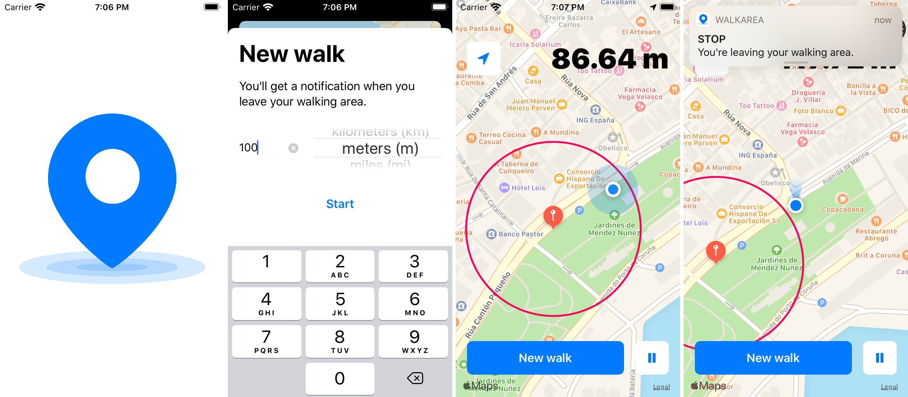
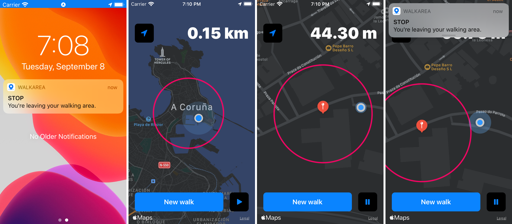

# WalkArea

Set up a walking area with this iOS app and receive notifications if you abandon it.

##  How to
 
* Select the radius of the walking area.
* Start walking.
* If you go outside the permitted zone, you will receive a notification.
* You can always see the distance to the starting point of the walk.

## Notifications

Works in background, the notifications will be delivered even if the device is locked or you have another application in the foreground, but don't kill the app.

* When you walk outside the permitted area, you receive the notification.
* Only one notification will be alive at one time.
* If you remove the it and you are still in the *Restricted area*, the notification will appear again.
* It will be visible until you go back to your walking area or you kill the app, in both cases, all the notifications will be removed.

## Permissions

Will be needed to use your location (select *Allow while using app*) and to send notifications, otherwise it won't work.

## Localization

* Spanish
* English
* Catalan
* French
* Italian

## Screenshots

Screenshots of the app running in an iPhone SE.

### Light mode

### Dark mode

